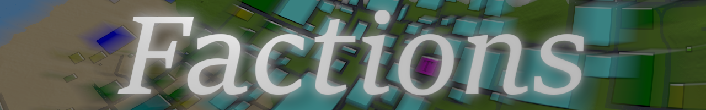
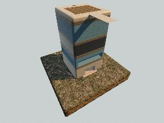

|  |
| :---: |
| *7 Days to Die mod for a condensed, team-focused raiding experience* |

# What is Factions?
This is a relatively small server-side overhaul mod for [7 Days to Die](https://7daystodie.com/) on PC.

*players are not required to download anything outside of 7DTD*

## Objective
Defend your faction's Claim Block in its steel fortress and destroy any opposing faction's Claim. If your faction is the last one remaining with a Claim Block, your team wins!

This style of gameplay can help to improve your PVP skills and generally have a great time with your buds.

### How is this different from other games/maps?
- Unlike typical 7DTD maps, these games are meant to be played in a single sitting and are generally expected to last a couple of hours.
- Every Factions map comes with a pre-built base for each faction that you can fortify.

## Getting Started
1. Start game, talk with trader, choose a faction
1. Talk with faction trader, choose a job
1. Ensure your faction's Claim Block has been set
1. Destroy enemy faction's Claim Block to win

## Features
*Everything added to the game is designed to bypass the startup grind, increase speed of play, and deliver an authentic 7DTD PVP experience in a form as condensed as possible.*

### Map
Small, custom [Nitrogen](https://community.7daystodie.com/topic/12730-a19-nitrogen-a-random-world-generator-for-7dtd/) maps tweaked for team play that comes with a pre-built Faction Base for each team:

#### Map Example
*4k map "Factions of Central City" shown*

#### Faction Base POI Example
*4 story steel base with roof shown*

### Job Loadouts / Specializations
Chosen by each player during setup, jobs allow you to start with pre-configured skillset and equipment catered to benefit your team in unique ways.
- Raider: dish out and live through incredible amounts of damage as a master of combat
- Looter: focused on speed and stealth, turning cities into goodie grab-bags. Supply the engineers and support raiders with your superior agility and stealth
- Engineer: upgrade your base, mine, and craft nearly anything to supply your team with an edge in the mission and defend your Faction's honor

### Boosted Quest XP Gains
Game time is short, but quests are time consuming: Earn 40x XP from Quests

- quest XP, specifically, is modded to 5x on top of default
- all XP boosted by an additional 8x, serverside

*Note: this is one of the best ways for Raiders and Looters to quickly gain levels*

### Fast Plant/Tree Growth
Farming is still useful when your veggies grow at incredible rates!

### Enhanced Harvesting Perks
*Greatly boosted perk-powered harvesting to enhance the benefit of support jobs and decrease the time required to reach meaningful gains.*

Perk | Default Boost at Max | Modded Boost
--- | --- | ---
Mother Lode | 2x | 50x
Lucky Looter | 5x | 50x
The Huntsman | 2x | 15x
Salvage Operations | 2x | 15x
Living Off The Land | 3x | 15x

*Note: this is perhaps the best way for Engineers to gain levels*

### Enhanced Crafting and Smelting
*Drastically reduced Smelting and Crafting times and become the king of crafting.*

Topic | Default Effect | Modded Effect
--- | --- | ---
Advanced Bellows forge attachment | reduce Smelting time by `33.3%` | reduce Smelting time by `99%`
Advanced Engineering lvl 5 | reduce crafting time `for workbench/forge recipes` by `20%` | reduce crafting time `for all recipes` so that `crafting has no delay for any recipe`

### Starting Gear
- 1 Land Claim Block
	- make sure one is placed between the spikes on your base's forth floor
- 3 Purified Water
- 3 Meat Stew
- Set of clothes specific to your faction
	- Snow: Puffer Coat, flannel shirt, denim pants
	- Desert: Leather Poncho, tank top, shorts
- 1 Motorcycle with a full tank of gas

#### Equipment by Skillset
Category | Raider | Looter | Engineer
--- | --- | --- | ---
**Weapons** | Steel Knuckles, AK-47, Desert Vulture | Machette, SMG-5, Marksman Rifle | Stun Baton, Robotic Turret, Pump Shotgun
**Weapon Mods** | 2 Muzzle Brake Mods, 2 Magazine Extender Mods, Hunter Mod, Rad Remover Mod, Reflex Sight Mod, Scope 4x Mod | 2 Silencer Mods, Scope 8x Mod | Wood Splitter Mod, Bunker Buster Mod, Grave Digger Mod, Iron Breaker Mod, 3 Diamond Tipped Mods
**Ammo** | 240 7.62AP, 120 .44HP | 270 9mmHP, 150 9mmAP, 120 7.62AP | 950 Robotic Turret Shells, 950 Robotic Turret AP Ammo, 140 Shotgun Shells, 140 Shotgun AP Slugs
**Armor** | Steel Helmet with Mid-Tier Heavy, Night Vision Goggles | Mid-Tier Light, Night Vision Goggles, Cigarette | Mid-Tier Heavy, Nerdy Glasses
**Armor Mods** | 4 Banded Armor Plating Mods | 3 Clothing Double Pocket Mods, 4 Armor Triple Pocket Mods, 1 Impact Bracing Mod | Helmet Light Mod
**Tools** | Auger | Impact Driver | Wire Tool, Steel Pickaxe, Steel Axe, Steel Shovel, Nailgun
**Consumables** | 5 First Aid Kits, 1 Fort Bites | 2 bottles of Grandpa's Awesome Sauce, 1 bottle of Recog | 10 cups of Blackstrap Coffee, 10 bowls of Sham Chowder
**Resources** | 300 Gas | 7500 Dukes, 40 Lockpicks | *lots... see below* 

#### Building Materials that come with each Engineer
- Pre-Constructed
	- 1 Rolling Garage Door 5x3
	- 6 Vault Doors
	- 3 Vault Hatch
	- 1 Generator Bank
	- 6 Small Engines
	- 1000 Gas
	- 1 Campfire
	- 1 Forge
	- 1 Workbench
	- 1 Cement Mixer
	- 1 Chem Station
	- 500 Cement Blocks
	- 5 Drawers
	- 9 Wooden Storage Boxes

#### Starting Recipes (every job)
- Forge Attachments Recipies:
	- Anvil
	- Bellows
	- Crucible
- Campfire/Oven Attachment Recipies:
	- CookingGrill
	- CookingPot

### Starting Skills/Perks
Perk | Max Level | Raider | Looter | Engineer
--- | :---: | :---: | :---: | :---:
**Perception** 			| **10** | 5 | 9 | 1
Dead Eye 				| **5** | 0 | 5 | 0
Demolitions Expert		| **5** | 3 | 5 | 0
Javelin Master 			| **5** | 0 | 0 | 0
Lock Picking 			| **3** | 0 | 3 | 0
The Infiltrator 		| **3** | 2 | 3 | 0
Animal Tracker			| **3** | 2 | 3 | 0
The Penetrator 			| **4** | 3 | 4 | 0
Lucky Looter 			| **5** | 0 | 5 | 0
Treasure Hunter 		| **3** | 0 | 3 | 0
Salvage Operations 		| **5** | 0 | 5 | 0
**Strength** 			| **10** | 6 | 1 | 10
Boomstick 				| **5** | 0 | 0 | 5
Pummel Pete 			| **5** | 0 | 0 | 5
Skull Crusher 			| **5** | 0 | 0 | 5
Sexual Tyrannosaurus 	| **4** | 0 | 0 | 4
Heavy Armor 			| **4** | 4 | 0 | 4
Pack Mule 				| **5** | 2 | 0 | 4
Master Chef 			| **5** | 0 | 0 | 5
Miner 69’er 			| **5** | 0 | 0 | 5
Mother Lode 			| **5** | 0 | 0 | 5
**Fortitude** 			| **10** | 9 | 1 | 5
The Brawler 			| **5** | 5 | 0 | 0
Machine Gunner 			| **5** | 5 | 0 | 0
The Huntsman 			| **5** | 5 | 0 | 0
Well Insulated 			| **3** | 3 | 0 | 0
Living Off The Land 	| **3** | 1 | 0 | 3
Pain Tolerance 			| **5** | 5 | 0 | 0
Healing Factor 			| **5** | 5 | 0 | 0
Iron Gut 				| **5** | 5 | 0 | 0
Rule 1: Cardio 			| **3** | 3 | 0 | 0
**Agility** 			| **10** | 7 | 9 | 1
Archery 				| **5** | 0 | 0 | 0
Gunslinger 				| **5** | 0 | 5 | 0
Deep Cuts 				| **5** | 0 | 5 | 0
Run and Gun 			| **3** | 3 | 3 | 0
Flurry of Blows 		| **3** | 0 | 5 | 0
Light Armor 			| **4** | 0 | 4 | 0
Parkour 				| **4** | 4 | 4 | 0
Hidden Strike 			| **5** | 0 | 5 | 0
From The Shadows 		| **5** | 0 | 5 | 0
**Intellect** 			| **10** | 1 | 7 | 10
Electrocutioner 		| **5** | 0 | 0 | 5
Robotics Inventor 		| **5** | 0 | 0 | 5
Better Barter 			| **5** | 0 | 4 | 0
The Daring Adventurer 	| **4** | 1 | 4 | 1
Charismatic Nature 		| **4** | 0 | 4 | 4
Physician 				| **4** | 0 | 0 | 4
Advanced Engineering 	| **5** | 0 | 0 | 5
Grease Monkey 			| **5** | 0 | 0 | 5

### Starting Book/Magazine Perks
Series | Raider | Looter | Engineer | Description
--- | :---: | :---: | :---: | ---
The Art of Mining | | | x | Buff Mining
The Automatic Weapon Handbook | x | | | Buff Automatic Weapons
Batter Up! | | | x | Buff Bats & Clubs
Bar Brawling | | | x | Buff Fists, recover health with punches
The Fireman's Almanac | | | x | Buff Axes
The Great Heist | | x | | Improve Lockpicking, 3 sec delay for motion detection, timed charges craft, land claim damage buff
The Hunter's Journal | | x | | Buff damage to & harvest of animals
Lucky Looter | | x | | Buff looting
Magnum Enforcer | | x | x | Buff magnums, Barter buff while holding magnum, craft special .44 ammo
Needle & Thread | | | x | Craft clothes
The Night Stalker | | x | | Buff night activities, not encumbered during night
Pistol Pete | x | x | x | Buff pistols, craft special 9mm ammo, ignore armor at close range
Ranger's Guide to Archery | | x | x | Buff Archery, craft special arrows
Shotgun Messiah | | | x | Buff shotguns, craft special shells
Sniper | | x | x | Buff scope damage, reload, zooming, craft special 7.62 ammo, craft Ghillie suit
Spear Hunter | | x | / | Buff spear use, craft steel spear
Urban Combat | | x | | Craft stealth boots, cigars, no sound over trash, less sound on landing, boost sneak jump height, land mines don't explode, ignore armor slowdown when in combat, silencers have no damage
Tech Junkie | | | x | Buff Robotic weapons, craft special turret ammo
Wasteland Treasures | | x | | Buff looting of certain items

## Mods included from other authors

### Delmod Kitchen
*[Credit goes to Del Stryker](https://github.com/DelStryker/Delmod)*

Adds working Stove, Working Oven, Working Sink, and Working Granite Sink that can be crafted at Level 1 of Advanced Engineering
- The Stove and Oven operate like the Campfire but the do not require fuel.
- The Sinks fill empty bottles with murky water by right mouse clicking on the sink with the bottle in your hand.

### khzmusik No Bedrolls
*[Credit goes to Karl Giesing](https://gitlab.com/karlgiesing/7d2d-modlets/tree/master/khzmusik_No_Bedrolls)*

- Bedrolls and beds no longer act as player spawn points, and no longer prevent zombie spawns

*Note: Factions will have you spawn in the same location you started the map in, which is roughly halfway between each base. This means you're already halfway to the enemy base if you're attacking, but also as much as halfway away from your own base if you're defending*

## FAQ
- Is there a recommended team size?
	- 2 people to each team is good
	- 3 or more to each team makes for a much better experience. This is because the 3 Job Specializations really are geared to support one another
- Why'd you make this?
	- We usually play on a [specific server](https://7daystodie-servers.com/server/87258/) together and are generally very happy with the community, but practicing PVP with each other or experimenting with adjustments in damage output from 7DTD version updates can negatively impact our characters. Having a fresh game we can hop into for friendly PVP and experimentation felt like a good idea
